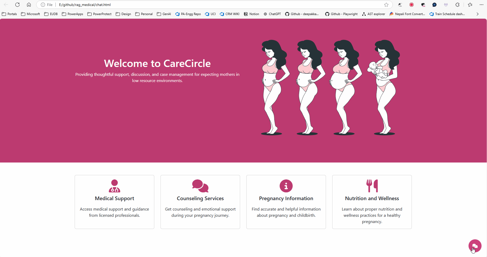

# RAG Medical

This project implements Retrieval-Augmented Generation (RAG) using FAISS for a medical support application called CareCircle. The application provides accurate answers to user questions based on the organization's knowledge base.



## Table of Contents

- [RAG Medical](#rag-medical)
  - [Table of Contents](#table-of-contents)
  - [Introduction](#introduction)
  - [Features](#features)
  - [Installation](#installation)
  - [Usage](#usage)
  - [API Endpoints](#api-endpoints)
    - [`/your_endpoint`](#your_endpoint)
  - [Authentication](#authentication)
  - [Datasets](#datasets)
  - [Technologies Used](#technologies-used)
  - [Contributing](#contributing)
  - [License](#license)

## Introduction

Retrieval-Augmented Generation (RAG) is a technique that combines retrieval-based and generation-based approaches to provide accurate and contextually relevant answers to user queries. This implementation uses FAISS (Facebook AI Similarity Search) to efficiently search and retrieve relevant documents from a large knowledge base. The language model used for generating answers is provided by AzureOpenAI.

## Features

- Provides accurate answers to user questions using a combination of retrieval and generation techniques.
- Supports multiple document formats including JSON, CSV, and text files.
- Ensures patient confidentiality and compliance with HIPAA regulations.
- Includes authentication to secure API endpoints.

## Installation

1. Clone the repository:

    ```bash
    git clone https://github.com/kambojananya/carecircle_rag.git
    cd carecircle_rag
    ```

2. Create a virtual environment and activate it:

    ```bash
    python -m venv .venv
    source .venv/bin/activate  # On Windows, use `.venv\Scripts\activate`
    ```

3. Install the required dependencies:

    ```bash
    pip install -r requirements.txt
    ```

4. Set up environment variables by creating a `.env` file:

    ```plaintext
    AZURE_OPENAI_API_KEY=your_azure_openai_api_key
    ```

## Usage

1. Run the Flask application:

    ```bash
    python rag_medical.py
    ```

2. The API will be available at `http://127.0.0.1:5000`.

## API Endpoints

### `/your_endpoint`

- **GET**: Executes a query using Retrieval-Augmented Generation (RAG) for CareCircle data to provide accurate answers to user questions based on the organization's knowledge base.

    **Headers**:
    - `Authorization`: Bearer token for authentication.

    **Response**:
    - `200 OK`: Returns the answer to the user's question.
    - `403 Forbidden`: If the authentication token is incorrect.

## Authentication

The API requires an authentication token to be included in the request header. The token provided by the user is compared with the system token (`111-1111-11111`). If the token is incorrect, a `403 Forbidden` error is returned.

## Datasets

The project uses two datasets:
1. **CareCircle Group**: Information about the CareCircle organization, including profiles of key members, contact information, working hours, holidays, mission statement, and long-term goals.
2. **Pregnancy Guide for Expecting Mothers**: A comprehensive guide providing information and support for expecting mothers.

## Technologies Used

- **Flask**: A micro web framework for Python.
- **Flask-RESTx**: An extension for Flask that adds support for quickly building REST APIs.
- **FAISS**: A library for efficient similarity search and clustering of dense vectors.
- **LangChain**: A library for building language model applications.
- **AzureOpenAI**: Provides the language model for generating answers.
- **dotenv**: A module to load environment variables from a `.env` file.
- **Colorama**: A library for colored terminal text.
- **Pandas**: A data manipulation and analysis library.
- **NumPy**: A library for numerical computing.

## Contributing

Contributions are welcome! Please open an issue or submit a pull request for any improvements or bug fixes.

## License

This project is licensed under the MIT License. See the LICENSE file for details.
